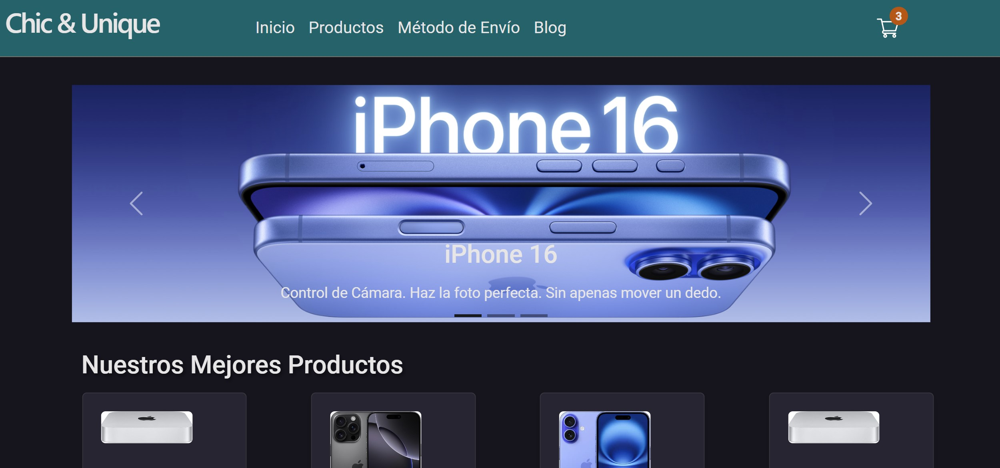
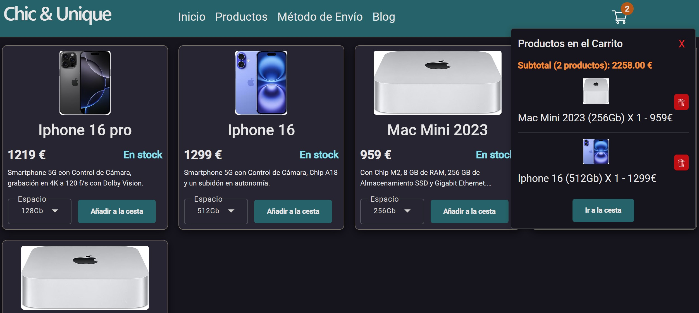
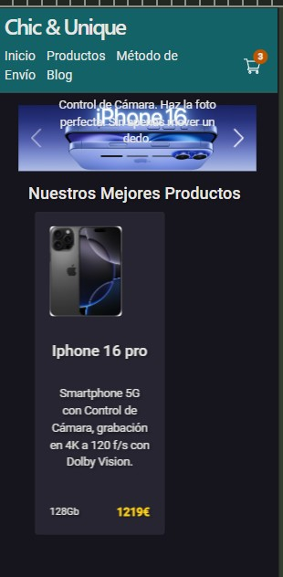
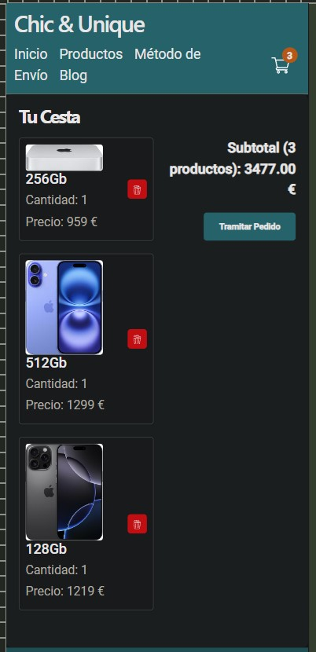

# Ng-shop

This project is an Angular-based online shop that is currently under construction. At this stage, it includes the product views and shopping cart functionality only. 
The project is in Spanish.

## **update:** *home page with carousels, product details, cart, stripe installed, not configured*

## PC


<div style="display: flex; align-items: center; width: 100%;">
  
  
</div>

## SmartPhone

<div style="display: flex; align-items: center; width: 100%;">
  
  
</div>

## Install

navigate to the project and write npm i

## Start the web to get started

Run `ng serve` for a dev server. Navigate to `http://localhost:3000/` Or click on Ejecutar.bat and it will start by itself (Windows).
The application will automatically reload if you change any of the source files.

--------------------------------------------------

## Code scaffolding

Run `ng generate component component-name` to generate a new component. You can also use `ng generate directive|pipe|service|class|guard|interface|enum|module`.

## Build

Run `ng build` to build the project. The build artifacts will be stored in the `dist/` directory.

## How to modify products

To modify the products, go to `src/data/data`, where you can find `export const productsData = [ cardProduct1, cardProduct2, macMini, cardProduct4, cardProduct5 ] as ProductDataInterface[];`. By changing the properties of these objects, you can add your own products.

### Example

```javascript
export const cardProduct1 = {
  title: 'Iphone 16 pro',
  description: 'Smartphone 5G con Control de Cámara, grabación en 4K a 120 f/s con Dolby Vision.',
  stock: true,
  imageUrl: 'images-products/1.jpg',
  options: [
    {
      price: 1219, 
      tipo: "128Gb"
    },
    {
      price: 1540,  
      tipo: "256Gb"
    },
    {
      price: 1800,  
      tipo: "512Gb"
    }
  ]
};

