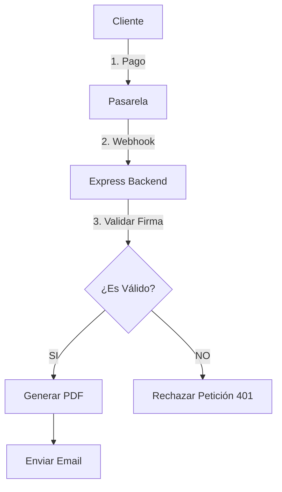

# 🛍️ Angular Shop Premium

Este es un ecosistema de tienda online profesional desarrollado con **Angular 21**, diseñado para ser escalable, seguro y visualmente impactante.

[](https://angular.io/)
[](https://vitejs.dev/)
[](https://www.typescriptlang.org/)

---

## 🚀 Características Principales

- **🛡️ Multi-Pasarela de Pago**: Integración nativa con **Monei**, **Stripe** y **Redsys** (Soporte 3DS).
- **📝 Facturación Automatizada**: Generación de facturas PDF profesionales y envío automático por email.
- **⚡ Rendimiento Optimizado**: Uso de **Lazy Loading**, **Signals** (Angular 21) y **SSR** (Server Side Rendering).
- **🎨 Diseño Premium**: Interfaz moderna, responsiva y con gestión dinámica de temas (Signals-based).
- **📧 Plantillas de Email**: Notificaciones elegantes usando `react-email`.

---

## ⚙️ Guía de Configuración Profesional

El proyecto está diseñado para ser configurado mediante archivos de datos estáticos, evitando la dependencia inicial de una base de datos para facilitar el despliegue rápido.

### 1. Configuración Global de la Tienda
Edita `src/data/data.ts` para gestionar la identidad de la tienda:

```typescript
export const dataWeb = {
  nameShop: 'Tecnología Avanzada',
  email: 'soporte@tu-tienda.com',
  phone: '+34 900 123 456',
  address: 'Calle Innovación 42, Madrid, España',
  nif: 'A12345678',
  shippingCost: 9, // Coste de envío estándar en EUR
  // Los logos se gestionan dinámicamente según el entorno (PC/Móvil)
  logo: {
    mobile: '...',
    pc: '...',
    icon: '...',
  }
};
```

### 2. Gestión de Catálogo y Productos
Los productos se definen en `src/data/products-data.ts`. Cada producto soporta múltiples opciones y variaciones de precio.

```typescript
export const productExample = {
  title: 'Nombre del Producto',
  description: 'Descripción detallada para SEO.',
  stock: true,
  imageUrl: 'ruta/imagen.jpg',
  category: 'Electronica',
  options: [
    { price: 100, tipo: 'Básico' },
    { price: 150, tipo: 'Premium' }
  ]
};
```

### 3. Orquestación de Pagos
Para cambiar entre pasarelas, ajusta la constante `selectedMethodPay` en `src/data/data.ts`:
```typescript
export type MethodPayInterface = 'monei' | 'stripe' | 'redsys';
export const selectedMethodPay: MethodPayInterface = 'monei';
```

---

## �️ Arquitectura de Webhooks y Seguridad

El sistema utiliza un flujo de comunicación asíncrona para garantizar la integridad de las transacciones:

1. **Intención de Pago**: El cliente solicita un pago al backend.
2. **Notificación (Webhook)**: La pasarela (Monei/Stripe/Redsys) envía un POST al servidor.
3. **Validación de Firma**: **[CRÍTICO]** El servidor verifica la firma `MONEI-Signature` o `Stripe-Signature` usando el `rawBody` de la petición.
4. **Procesamiento**: Tras validar, el sistema genera la factura en PDF y la envía por email de forma atómica.


```mermaid
graph TD
    A[Cliente] -- 1. Pago --> B[Pasarela]
    B -- 2. Webhook --> C[Express Backend]
    C -- 3. Validar Firma --> D{¿Es Válido?}
    D -- SI --> E[Generar PDF]
    E --> F[Enviar Email]
    D -- NO --> G[Rechazar Petición 401]
```

---

## 📑 Desarrollo y Despliegue

### Requisitos Locales (Webhooks)
Si estás desarrollando en local, las pasarelas no podrán "ver" tu `localhost`. Debes usar un túnel seguro como **ngrok**:
```bash
ngrok http 3000
```
Luego actualiza `SERVER_PUBLIC_URL` en tu `.env` con la URL de ngrok.

### Comandos Útiles
- `npm run start`: Inicia el servidor SSR y el cliente en el puerto 3000.
- `npm run build`: Genera el bundle optimizado para producción.

---

## 🧾 Integración con Redsys (3DS)

| Tarjeta | Número | Caducidad | CVV |
| :--- | :--- | :---: | :---: |
| **VISA** | `4548 8100 0000 0003` | 12/49 | 123 |
| **Mastercard** | `5576 4415 6304 5037` | 12/49 | 123 |

---

## 👨‍💻 Autor
Desarrollado con ❤️ por **Albert Benavent**.
