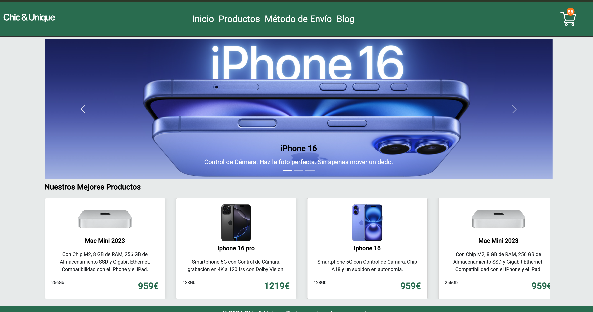
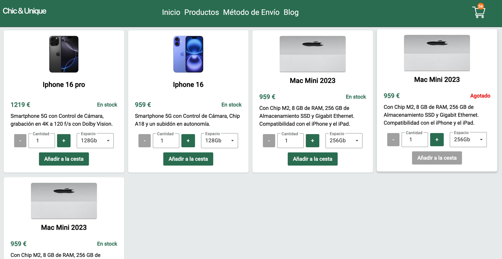
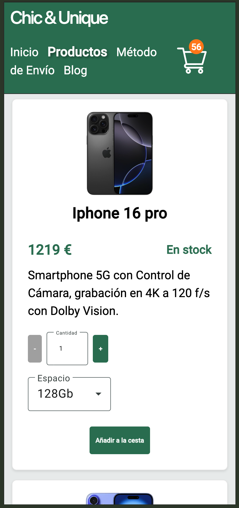
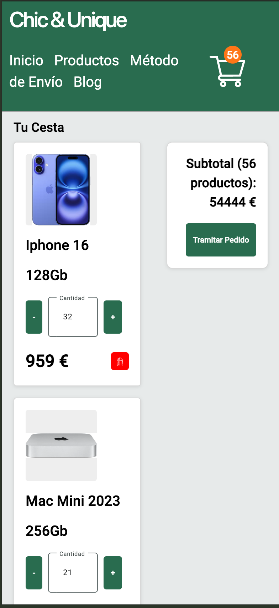

# Ng-shop

This project is an online store built with Angular.

The project is in Spanish. Stripe is configured, but you will need to update your keys: change the public key in the frontend and the private key on the server. The keys are located in the .env files.

To start the server, navigate to the stripe-server directory and run: npm start

**V1.1 Features:**

    •	Multiple payment gateways.
    •	Invoice delivery via email with React HTML templates.
    •	PDF generation attached with the company’s logo and VAT included.

### Components:

- Carousel with animations
- Forms for user inputs
- Shopping cart for managing products
- Button to download invoices in PDF format
- Responsive design for all devices

### Configuration:

- Data, colors, and sections are configured in data.ts.
- Product configuration is located in products-data.ts, both in the data folder.
- In selectedMethodPay, you can use monei or stripe. This will automatically switch the payment method.

**Webhooks and External Communication:**

    -  The server includes an example .env file. For the webhooks to work, use ngrok or any other tool to expose your local server to the internet.
    -  If you deploy the server outside your local machine, this issue will not occur.
    -  External communication allows payment gateways to return the status of the order (successful or failed) to the server.
    -  Once the server receives the payment status, it sends a PDF invoice with a React HTML template.

## PC

<div style="display: flex; align-items: center; width: 100%;">
  
  
</div>

## SmartPhone

<div style="display: flex; align-items: center; width: 100%;">
  
  
</div>

## Install

navigate to the project and write npm i

## Start the web to get started

Run npm run start to start both the client and server. The client will run on http://localhost:3000/, and the server will run on http://localhost:4000/.

The application will automatically reload if you change any of the source files.

Alternatively, you can click on start-mac.sh (for macOS) or start-windows.bat (for Windows) to start the application.

---

## How to modify products

To modify the products, go to `src/data/products-data.ts`. This file contains an array of product objects exported as `productsData`. Each product has properties such as `title`, `description`, `stock`, `imageUrl`, `category`, and `options`. You can add or update products by modifying the objects in this file.

### Example

```javascript
export const cardProduct1 = {
  title: "Iphone 16 pro",
  description: "Smartphone 5G con Control de Cámara, grabación en 4K a 120 f/s con Dolby Vision.",
  stock: true,
  imageUrl: "images-products/1.jpg",
  options: [
    {
      price: 1219,
      tipo: "128Gb",
    },
    {
      price: 1540,
      tipo: "256Gb",
    },
    {
      price: 1800,
      tipo: "512Gb",
    },
  ],
};
```
