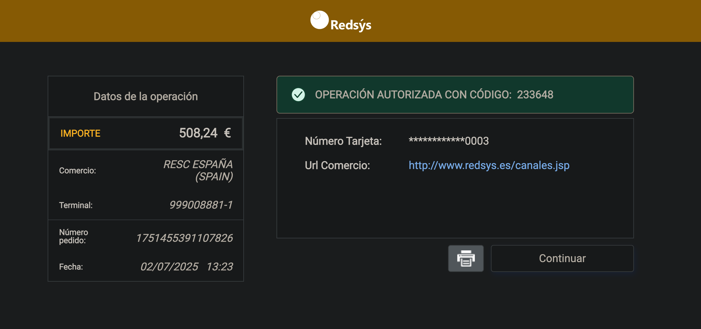

# 🛍️ Ng-shop

This project is an online store in Spanish created with Angular.

[](https://angular-shop-iota.vercel.app/)

---

## 💳 Payment Methods

It supports **three payment gateways**:

```ts
type MethodPayInterface = 'monei' | 'stripe' | 'redsys';
```

### ✨ Features V1.3:\*\*

- Multiple payment gateways (Redsys, Monei, Stripe)
- Invoice delivery via email with React HTML templates
- PDF invoice generation with logo and VAT included

### 🧩 Components:

- Carousel with animations
- Forms for user inputs
- Shopping cart with product management
- Button to download invoices in PDF
- Responsive design for all devices

### ⚙️ Configuration:

- All data is defined in data.ts
- Products are configured in products-data.ts
- In selectedMethodPay, you can use monei or stripe. This will automatically switch the payment method.

  ```export const dataWeb = {
  nameShop: 'Tecnología Avanzada',
  name: 'mike',
  email: 'soporte@tecnologiaavanzada.com',
  instagram: 'https://www.instagram.com',
  youtube: 'https://www.youtube.com',
  phone: '+34 900 123 456',
  address: 'Calle Innovación 42, 28001 Madrid, España',
  nif: 'A12345678',
  paymentIntentUrl:
   (selectedMethodPay as MethodPayInterface) === 'stripe'
     ? 'http://localhost:4000/stripe-payment'
     : 'http://localhost:4000/monei-payment',

  shippingCost: 9,
  logo: {
   mobile: `${directory}/images-logo/logo-head-mobile.png`,
   pc: `${directory}/images-logo/logo-head.png`,
   icon: `${directory}/icon.ico`,
  },
  ```

### 🔗 Webhooks and External Communication:

    -  The server includes an example .env file. For the webhooks to work, use ngrok or any other tool to expose your local server to the internet.
    -  If you deploy the server outside your local machine, this issue will not occur.
    -  External communication allows payment gateways to return the status of the order (successful or failed) to the server.
    -  Once the server receives the payment status, it sends a PDF invoice with a React HTML template.

### 🖥️ PC

<div style="display: flex; align-items: center; width: 100%;">
  
  
</div>

## 📱 SmartPhone

<div style="display: flex; align-items: center; width: 100%;">
  
  
</div>

---

## 🧾 Redsys Integration

Ng-shop also includes full support for **Redsys** with **3DS protocol**.

You can test the Redsys payment integration using these test cards:

🔗 [Redsys Test Cards and Environments](https://pagosonline.redsys.es/desarrolladores-inicio/integrate-con-nosotros/tarjetas-y-entornos-de-prueba/)

| **Brand**  | **Protocol** | **Card Number**     | **Expiry** | **CVV** |
| ---------- | ------------ | ------------------- | ---------- | ------- |
| VISA       | EMV3DS 2.2   | 4548 8100 0000 0003 | 12/49      | 123     |
| Mastercard | EMV3DS 2.1   | 5576 4415 6304 5037 | 12/49      | 123     |



### Other Characteristics

| **View template in server**                                                        | **PDF template in server**                        | **Cart**                           |
| ---------------------------------------------------------------------------------- | ------------------------------------------------- | ---------------------------------- |
| localhost:4000/preview-email<br> |  |  |

---

## Install

Navigate to the project and run:

npm i

## ▶️ Start the web to get started

Run npm run start or ng serve to start both the client and server. Both run on http://localhost:3000/

Alternatively, you can click on start-mac.sh (for macOS) or start-windows.bat (for Windows) to start the application.

---

## How to modify products

To modify the products, go to `src/data/products-data.ts`. This file contains an array of product objects exported as `productsData`. Each product has properties such as `title`, `description`, `stock`, `imageUrl`, `category`, and `options`. You can add or update products by modifying the objects in this file.

### Example

Each product is an object with properties such as:

- title

- description

- stock

- imageUrl

- category

- options (with price and tipo)

```javascript
export const cardProduct1 = {
  title: 'Iphone 16 pro',
  description: 'Smartphone 5G con Control de Cámara, grabación en 4K a 120 f/s con Dolby Vision.',
  stock: true,
  imageUrl: 'images-products/1.jpg',
  options: [
    {
      price: 1219,
      tipo: '128Gb',
    },
    {
      price: 1540,
      tipo: '256Gb',
    },
    {
      price: 1800,
      tipo: '512Gb',
    },
  ],
};
```

```

```
